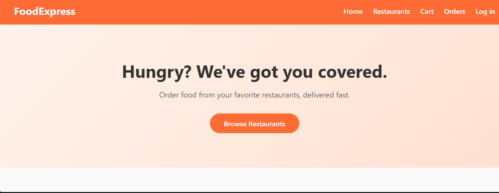

# FoodExpress — Dynamic Food Delivery Application (MERN Stack)

A full stack food delivery web app where users can browse restaurants, explore menus, place orders, pay online, and track deliveries in real time.

**Project Code:** FS07P5A · **Domain:** Full Stack Development · **Client:** Rixi Lab Technologies

---


## Features

- User authentication with JWT (signup, login, protected routes)
- Browse restaurants and menus (data-driven, not hardcoded)
- Cart with quantity controls and live total
- Order placement and full order history
- Real-time order status tracking via Socket.io — no page refresh needed
- Secure payments via Razorpay, with server-side signature verification
- Automated backend test suite (Jest + Supertest)
- Ready for cloud deployment (Vercel + Render + MongoDB Atlas)

## Tech Stack

| Layer | Technology |
|---|---|
| Frontend | React.js, React Router, Axios, Vite |
| Backend | Node.js, Express.js |
| Database | MongoDB with Mongoose |
| Auth | JSON Web Tokens (JWT), bcrypt.js |
| Real-time | Socket.io |
| Payments | Razorpay |
| Testing | Jest, Supertest |
| Deployment | Vercel (frontend), Render (backend), MongoDB Atlas |

## roject Structure

```
food-delivery-app/
├── client/                 # React frontend (Vite)
│   └── src/
│       ├── components/     # Navbar, RestaurantCard, etc.
│       ├── context/        # AuthContext, CartContext
│       ├── pages/          # Home, RestaurantListing, MenuPage, Cart, Login, Signup, OrderHistory, TrackOrder
│       └── services/       # api.js (Axios), socket.js (Socket.io client)
├── server/                 # Express backend
│   ├── config/             # MongoDB connection
│   ├── controllers/        # Business logic per resource
│   ├── middleware/         # JWT auth middleware
│   ├── models/             # User, Restaurant, MenuItem, Order
│   ├── routes/             # REST route definitions
│   ├── tests/              # Jest + Supertest suite
│   ├── app.js               # Express app (importable for tests)
│   └── server.js            # Server bootstrap (Socket.io + DB connect + listen)
├── SPRINTS.md               # Day-by-day development log
├── DEPLOYMENT.md            # Step-by-step deployment guide
├── render.yaml               # Render deployment config
└── Project_Report_FS07P5A.pdf/docx  # Full project report
```

## Getting Started

### Prerequisites
- Node.js (v18+)
- A MongoDB connection string (local MongoDB or free [MongoDB Atlas](https://www.mongodb.com/cloud/atlas) cluster)
- Razorpay test API keys (free from the [Razorpay Dashboard](https://dashboard.razorpay.com/)) — only needed for the payment flow

### 1. Clone the repo
```bash
git clone https://github.com/RahulBiswas224/fs07p5a_MernFoodDelivery.git
cd fs07p5a_MernFoodDelivery
```

### 2. Backend setup
```bash
cd server
npm install
cp .env.example .env
# Edit .env: set MONGO_URI, JWT_SECRET, RAZORPAY_KEY_ID, RAZORPAY_KEY_SECRET
npm run dev
```
Server runs at `http://localhost:5000`. Health check: `GET /api/health`

### 3. Frontend setup
```bash
cd client
npm install
npm run dev
```
App runs at `http://localhost:5173` (Vite dev server proxies `/api` to the backend).

### 4. Run tests
```bash
cd server
npm test
```

## API Overview

Full endpoint reference is in [`server/README.md`](./server/README.md). Summary:

| Resource | Base route |
|---|---|
| Auth | `/api/auth` — signup, login, me |
| Users | `/api/users` — CRUD |
| Restaurants | `/api/restaurants` — CRUD |
| Menu items | `/api/menu` — CRUD |
| Orders | `/api/orders` — place, history, status |
| Payments | `/api/payments` — create-order, verify |

## Development Timeline

Built as 8 daily sprints, Sep 1 – Sep 8, 2026. Full breakdown in [`SPRINTS.md`](./SPRINTS.md).

| Sprint | Focus |
|---|---|
| 1 | Project setup, homepage & restaurant listing UI |
| 2 | Express server, MongoDB connection, REST APIs |
| 3 | JWT authentication |
| 4 | Frontend-backend integration |
| 5 | Cart, order placement, order history |
| 6 | Real-time order tracking (Socket.io) |
| 7 | Razorpay payments + automated testing |
| 8 | Deployment configuration + final report |

## Deployment

See [`DEPLOYMENT.md`](./DEPLOYMENT.md) for the full walkthrough (MongoDB Atlas → Render → Vercel).

## Project Report

The complete project report — architecture, database design, module breakdown, API reference, test results, and conclusion — is available as [`Project_Report_FS07P5A.pdf`](./Project_Report_FS07P5A.pdf).

## Author

Rahul Biswas — Full Stack Development, Project FS07P5A, Rixi Lab Technologies